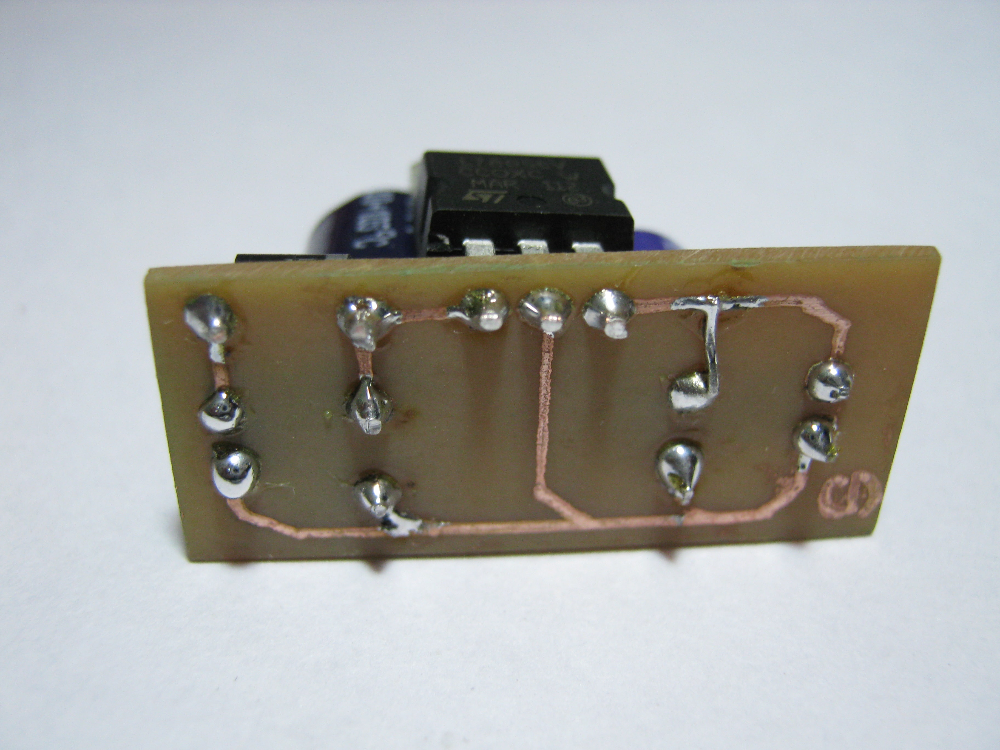

# Fun with etching!

 I tried etching my own PCB's with Ferric Chloride, for the mask, I just used a permanent marker and used a tiny drill bit for making the holes.

## Making an alternatively blinking lights using NE555

  

Making the holes:

  

 
Soldering the components:

  

Finally :)

  

## Making a %V Volatage step down reegulator for another project

  

Etched surface

  

 
Soldering the components:

  

  

